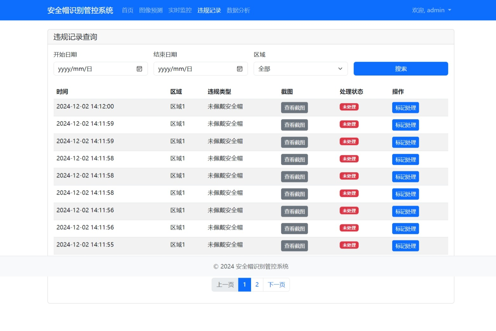

# 安全帽识别系统（helmet_check_system）
## create system in 2024-11 | 创建本项目于2024年十一月
---
## 技术栈 (Technology Stack)
- python 3.10 + django + sqlite
- YOLO
- Bootstrap5.3.0
## 完整代码（system code）
### Not free
- 邮件: zoelen@qq.com
- https://www.yuque.com/zoelen/pnmpc7/vgdngg9r5afcyn63?singleDoc#
---
## 系统展示（system preview）

